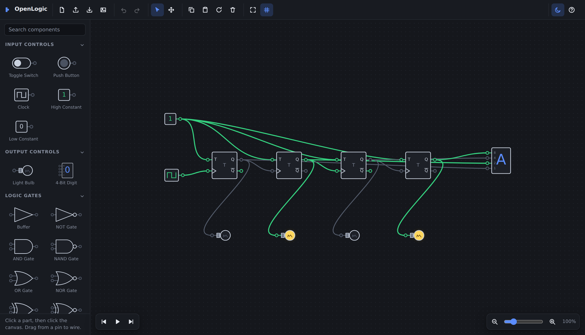

# OpenLogic

A logic circuit simulator that runs entirely in your browser. No account, no
server, no license key. Circuits are plain JSON files you own.

Built as a free replacement for the desktop logic simulators that charge for
what is, in the end, a canvas and a settling loop.



## Running it

It's static HTML, CSS and JavaScript with no build step and no dependencies.

**Locally** — open `index.html` in a browser. That's it; it works from a
`file://` URL. (If you'd rather serve it: `python3 -m http.server`.)

**Deployed** — copy the whole folder to any static host:

| Host | How |
| --- | --- |
| GitHub Pages | Settings → Pages → deploy from branch, root folder |
| Netlify / Vercel | Drag the folder in, or connect the repo; no build command |
| S3 / Cloudflare / nginx | Upload as-is |

Nothing is transmitted anywhere. The app never makes a network request after
the page loads.

## Saving your work

- **Download** (`Ctrl`+`S`) writes a `.json` file you can keep, email, or
  commit to git.
- **Open** (`Ctrl`+`O`) loads one back — or just drag the file onto the canvas.
- **Export PNG** saves a picture of the circuit.

The browser's local storage also keeps your current circuit as a crash net, so
a refresh doesn't cost you work. That is *not* a save mechanism: clearing site
data erases it. Download anything you care about.

## Components

| Inputs | Outputs | Gates | Flip-flops |
| --- | --- | --- | --- |
| Toggle Switch | Light Bulb | Buffer, NOT | SR |
| Push Button | 4-Bit Digit | AND, NAND | D (with PRE/CLR) |
| Clock | | OR, NOR | JK |
| High / Low Constant | | XOR, XNOR | T |
| | | Tri-State | |

AND/NAND/OR/NOR/XOR/XNOR take 2–8 inputs — select one and change **Inputs** in
the panel on the right.

## Signals

Wires carry four states, not two. This is what makes Tri-State worth having
and what turns a shorted bus into something you can see:

| Colour | Meaning |
| --- | --- |
| Grey | `0` |
| Green | `1` |
| Gold, dashed | Floating (`Z`) — nothing is driving this net |
| Red | Conflict — two outputs are fighting over one net |

A gate reads a floating input as `0`, so an unconnected pin behaves like a
pulled-down one. An input pin accepts more than one wire; the drivers are
resolved onto a single net, which is how a tri-state bus works.

## Building circuits

- Click a part in the tray, then click the canvas. Hold `Shift` while placing
  to keep laying down more of the same part. Or drag the part straight in.
- Drag from one pin to another to wire them. Either direction works.
- Click a toggle switch or hold a push button while the simulation runs.

### Shortcuts

| | | | |
| --- | --- | --- | --- |
| `Ctrl`+`S` | Download | `Ctrl`+`O` | Open |
| `Ctrl`+`Z` | Undo | `Ctrl`+`Shift`+`Z` | Redo |
| `Ctrl`+`C`/`V`/`X` | Copy / paste / cut | `Ctrl`+`D` | Duplicate |
| `Ctrl`+`A` | Select all | `Del` | Delete selection |
| `R` | Rotate 90° | `Shift`+`R` | Rotate back |
| `Space`+drag | Pan | Scroll | Zoom |
| `0` or double-click | Zoom to fit | `Alt`+drag | Move without grid snap |
| `Esc` | Cancel / deselect | | |

On a touch screen, two fingers pinch to zoom and drag to pan.

## Simulation

The engine settles the circuit with repeated delta cycles: each pass computes
every input net from the currently published outputs, then evaluates every
component. It repeats until nothing changes.

Feedback that never settles — a ring of inverters — hits a 64-pass cap and is
reported in a banner instead of hanging the frame. That banner is information,
not an error: a ring oscillator genuinely has no stable state.

All flip-flops trigger on the **rising** clock edge. The D flip-flop's `PRE`
and `CLR` are **active high** (unlike a 7474), so an unconnected pin does
nothing rather than holding the part in reset forever.

`⏸` pauses. `⏭` steps to the next clock edge. `⏮` resets sequential state —
flip-flops and clocks — and leaves your switch positions alone.

## File format

```json
{
  "format": "openlogic-circuit",
  "version": 1,
  "nodes": [
    { "id": 1, "type": "toggle", "x": 60, "y": 90, "state": { "on": true } },
    { "id": 3, "type": "and", "x": 220, "y": 210, "props": { "inputs": 2 } }
  ],
  "wires": [
    { "id": 7, "from": [1, 0], "to": [3, 0] }
  ]
}
```

`from` and `to` are `[nodeId, pinIndex]`; `from` is always an output. The
loader skips components and wires it doesn't recognise rather than rejecting
the whole file, so a circuit saved by a newer version still opens.

## Adding a component

Every part is one `def({...})` call — size, pins, what it computes, how it
draws. The registry feeds the renderer, the palette and the simulator, so
nothing else needs to change:

```js
C.def({
  id: 'majority',
  name: 'Majority',
  category: 'gates',
  size: function () { return { w: 46, h: 52 }; },
  ports: function (node) {
    var s = this.size(node);
    return {
      inputs: H.spread(3, s.h).map(function (y, i) {
        return { name: 'ABC'[i], x: -C.LEAD, y: y, dir: 'left' };
      }),
      outputs: [{ name: 'Y', x: s.w + C.LEAD, y: s.h / 2, dir: 'right' }]
    };
  },
  evaluate: function (node, ins) {
    var n = ins.filter(S.high).length;
    return [S.fromBool(n >= 2)];
  },
  draw: function (ctx, node, env) {
    var s = this.size(node);
    ctx.beginPath();
    C.shapes.box(ctx, s.w, s.h);
    H.body(ctx, env);
    H.text(ctx, env, 'MAJ', s.w / 2, s.h / 2, 10);
  }
});
```

Drop it in a file under `js/`, add a `<script>` tag, and it appears in the
palette with a correct icon.

## Tests

The app has no dependencies. The tests do — Playwright, dev-only, not needed
to run or deploy anything:

```sh
npm install --no-save playwright && npx playwright install chromium
python3 -m http.server 8777 &
node tests/run.mjs
```

28 checks drive the real page in a real browser: half-adder truth table,
T flip-flop divide-by-2, tri-state `Z`/conflict resolution, oscillation
detection, file download and re-upload, undo/redo, and a `file://` boot.
See [tests/README.md](tests/README.md).

## Browser support

Any current Chrome, Edge, Firefox or Safari. Uses `<dialog>` (Safari 15.4+)
and `ResizeObserver`; no build tooling, no polyfills, no package manager.

## License

MIT — see [LICENSE](LICENSE).
